<table width=100% border=>
<tr><td colspan=2><h1>EXERCISE 03 - End to End scenario using REST and Gateway Cloud</h1></td></tr>
<tr><td><h3>SAP Partner Workshop</h3></td><td><h1> &nbsp;45 mins</h1></td></tr>
</table>


## Description
This document provides you with the exercises for the hands-on session on SAP Cloud Platform IoT with the following activities:

* Creating Device Data Model from IoT API Docs and IoT Cockpit
* Device onboarding with IoT Gateway Cloud using REST protocol
* Sending data with REST Client

>NOTE: Use Google Chrome browser and Firefox if needed


## Target group

* Developers
* People interested in SAP Leonardo and IoT


## Goal

The goal of this exercise is to use IoT using another protocol.


## Prerequisites

Here below are prerequisites for this exercise.

* An SAP IoT Service system (provided by your instructor)
* Chrome browser with Postman REST client


## Steps

1. [Introduction](#introduction)
1. [Device onboarding](#device-onboarding)
1. [Install the certificate](#install-certificate)
1. [Sending messages via REST using Postman](#sending-messages)
1. [Consuming and viewing sensor data](#consuming-sensor-data)


### <a name="introduction"></a> Introduction
The SAP Cloud Platform Internet of Things Service enables customers and partners to develop, customize, and operate IoT business applications in the cloud. IoT Services provides Lifecycle management at scale for IoT devices from onboarding to decommissioning. It also provides a way to securely connect to remote devices over a broad variety of IoT protocols. It provides gateway Edge which provides one-premise IoT edge processing and also gateway cloud which does centralized cloud based processing.

The IoT cockpit is the user interface of the solution and provides access to various functions. It is the main interface for users to interact with the Internet of Things core service. It can be used creating user & tenants. Creating device data model, Device Onboarding and adding new networks etc. it can also be used to deploy interceptors, retrieve network logs, visualize the data which is being ingested via IoT devices/sensors.  
	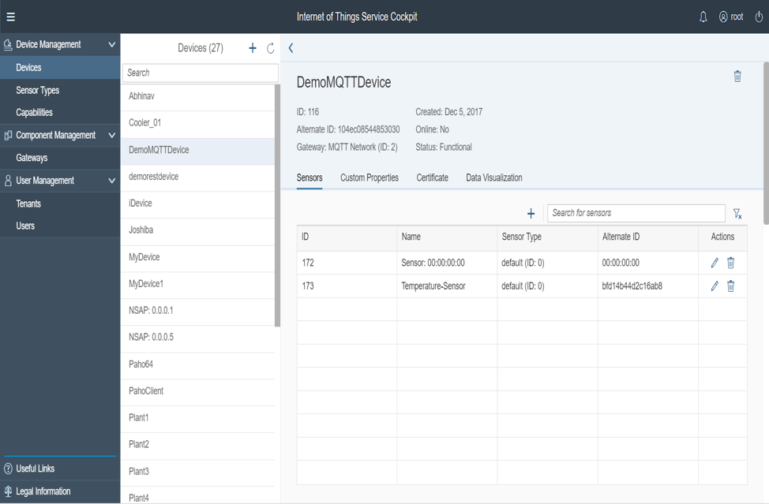

### <a name="device-onboarding"></a> Device onboarding
Each device exchanges data with a specific protocol (for example: REST in this exercise).  Each device corresponds to 1 unique physical node. We need to create physical node that corresponds to a physical device. In the following section, it is described how to create a Device for the REST network.

1.	On the IoT cockpit logon page, Click on **Device Management API**  
	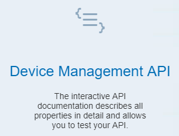
1. Choose **Authorize**
	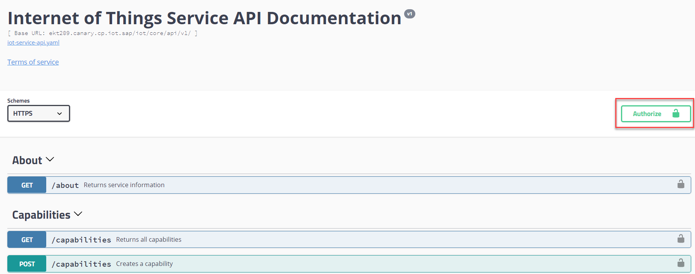
1.	Enter the user **name** and **password** provided by the instructor and choose **Authorize** to logon
	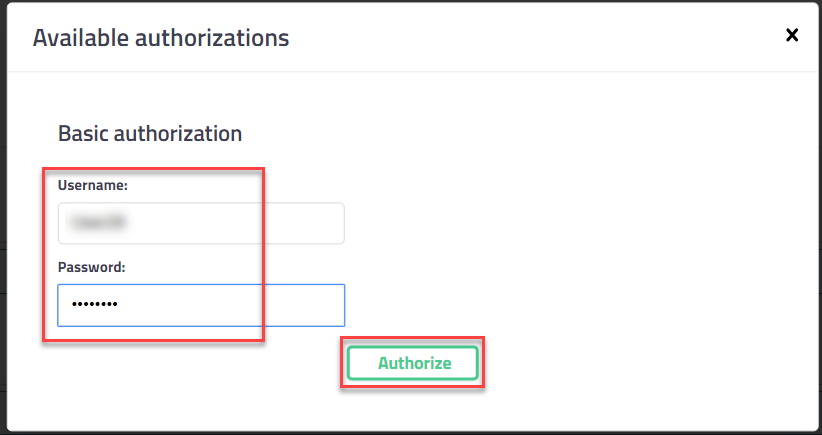
1. You should get an **Authorized** response. Close the the message from the top right corner  
	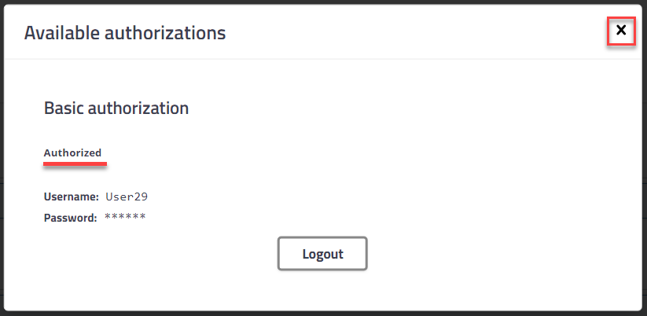
1.	 Choose the **Capabilities** section and open the **POST** request to create a new capability. Then click on **Try it out**  
	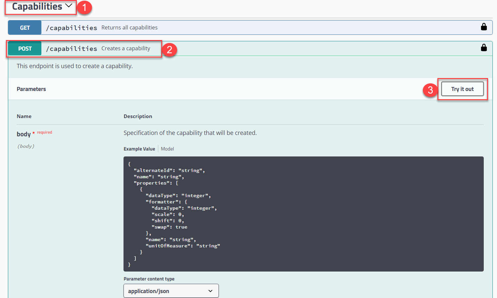
1.	Copy the following JSON script which defines a new capability named **Temperature** together with a new property and paste it in the **Example Value** text area.  

	```json
	{
	  "name": "Temperature",
	  "properties": [
	    {
	      "formatter": {
	        "swap": false,
	        "dataType": "float",
	        "shift": 0,
	        "scale": 0
	      },
		  "unitOfMeasure": "°C",
	      "dataType": "float",
	      "name": "Temperature"
	    }
	  ]
	}
	```
	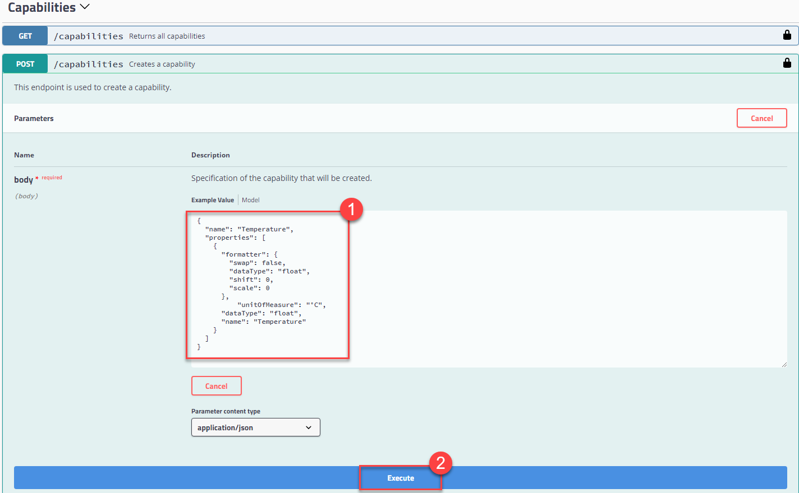
	
	
1.	You also need to enter your TENANT ID (which you can get when you login to the SCP IoT Service Cockpit) as below.
 
	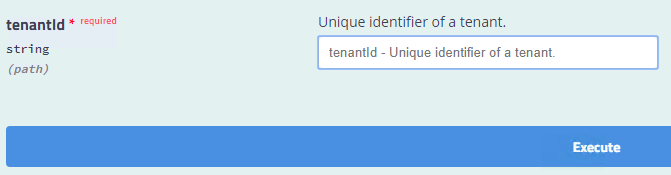

 	Then click **Execute** 

1.	You should get a response code of **200** and a response body like this. Copy and paste this response body in a text editor because you will need this information later in this section  
	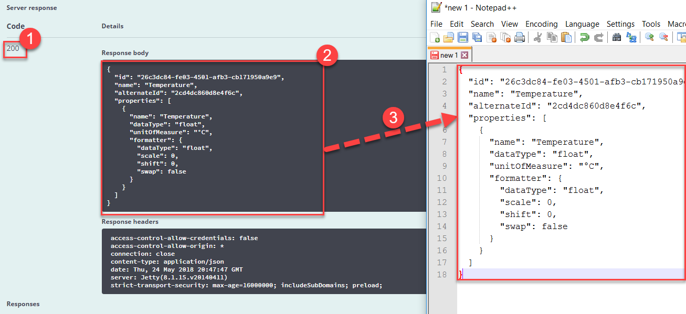

1.	Now you need to create a sensor type where the previously created Temperature capabilities is assigned to it. Go to the Home page of Device Management API services documentation and select **SensorTypes**  
	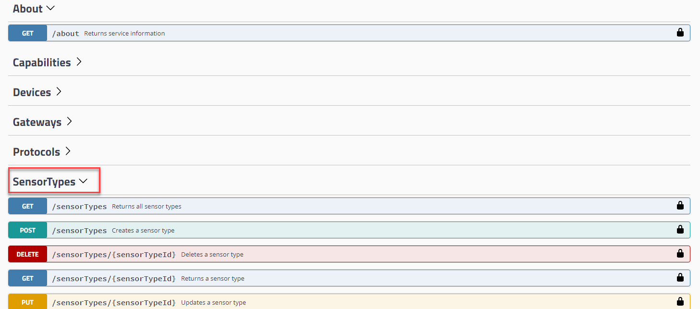

1.	Choose the **POST** request and click on **Try it out**  
	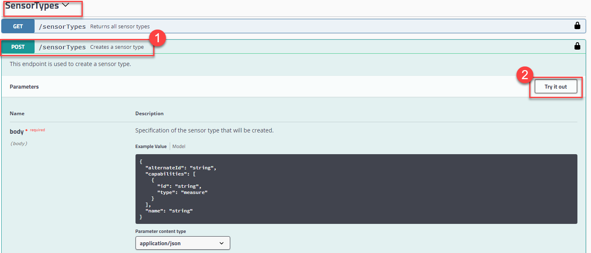

1.	Copy the following JSON script, which defines a new Sensor type with the name **gh\_climate\_sensor\_typ\_XX** (where **XX** must be replaced with your group number provided by the instructor). Replace **<<< Temperature Capability ID >>>** with the Temperature capability ID you have noted down in the previous steps. Once done paste the script in the **Example Value** text area and click **Execute**

 >NOTE: You must use **capabilities IDs** here because **AlternateIDs** are **NOT** used for creating sensor types

 ```json
 {
	  "protocol": "*",
	  "capabilities": [
	    {
	      "id": "<<< Temperature Capability ID >>>",
	      "type": "measure"
	    }
	  ],
	  "name": "gh_climate_sensor_typ_XX"
 }
 ```
 
 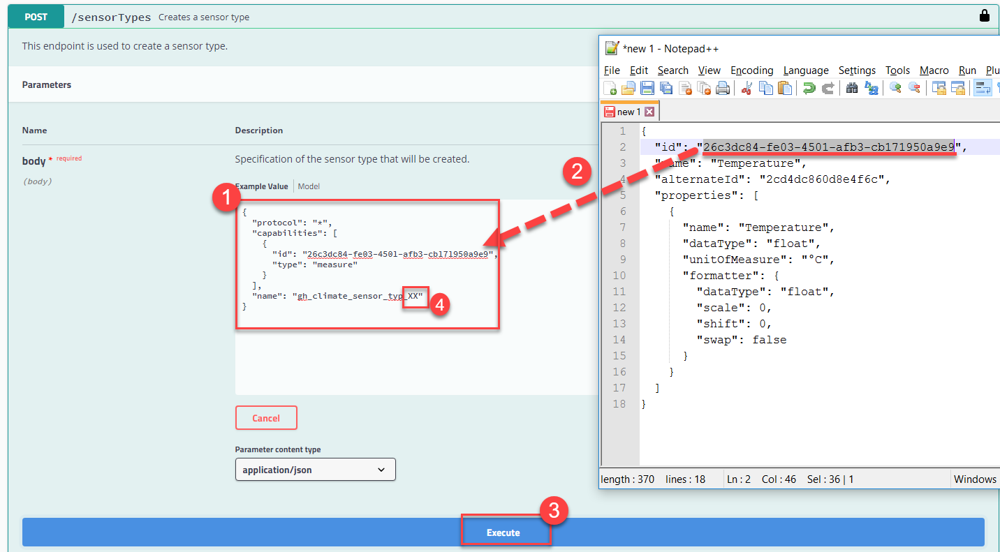
 
1.  Don't forget ! You also need to enter your TENANT ID (which you can get when you login to the SCP IoT Service Cockpit) as below.

 

Then click **Execute**. 

1. Log On to the **IoT Service Cockpit URL** with the credentials provided by the instructor  
	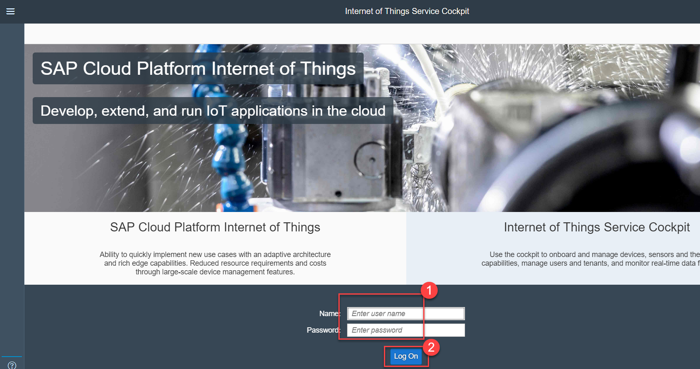

1.	Use the main menu to navigate to the **Device Management -> Devices** and click on the "**+**" to create a new device  
	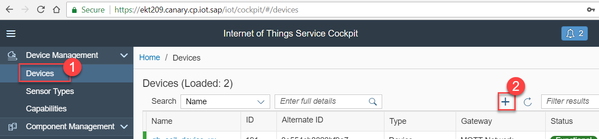

1.	In the **General Information** section, enter

	|Parameter|Value|
	|---------|-----|
	|Name|gh\_climate\_device\_XX|
	|Gateway|Rest Network|
	|Alternate ID|simply leave it blank|

	replacing **XX** with your workstation ID; then click on **Create**. This way you are creating a new device named **gh\_climate\_device\_XX** which is going to use the REST Network as a gateway.  

	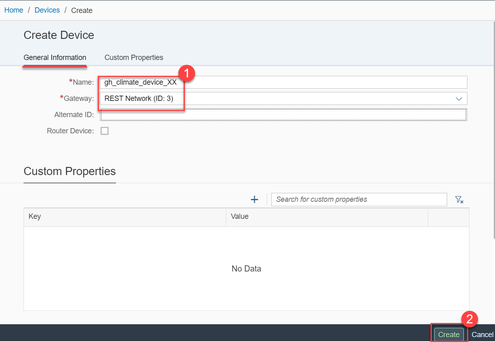

1.	Remaining on this device, in the **Sensor** tab click on "**+**" to add a new sensor to it  
	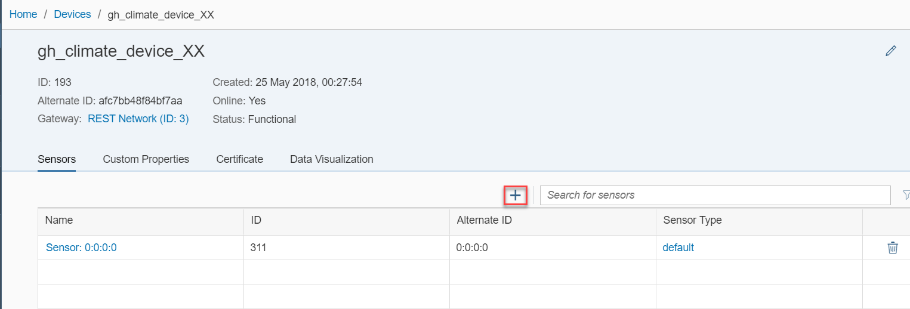

1.	In the **General Information** tab, enter replacing **XX** with your workstation ID; then click on **Add**  

	|Parameter|Value|
	|---------|-----|
	|Name|gh\_climate\_sensor\_XX|
	|Sensor Type|gh\_climate\_sensor\_typ\_XX|
	|Alternate ID|simply leave it blank|

 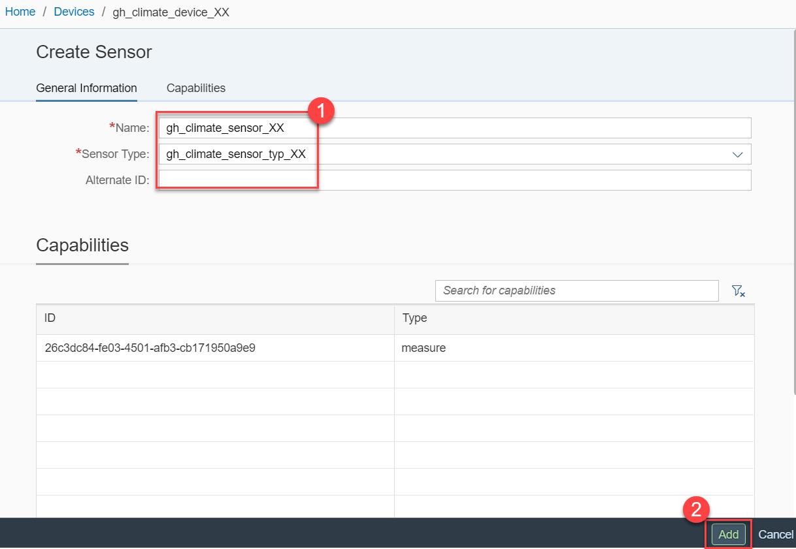

1. The device with the sensor is created
	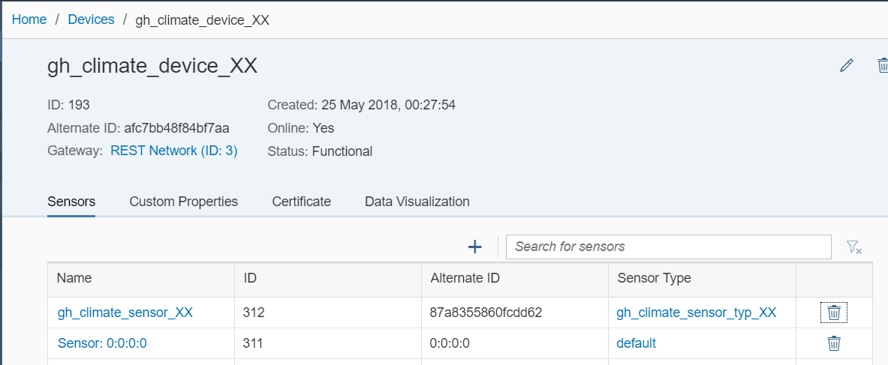

1. Go to the **Certificate** tab and click on the **Generate Certificate** button  
	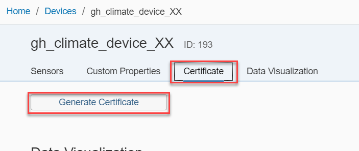

1.	Choose **p12** as the **Certificate Type** and click **Generate**  
	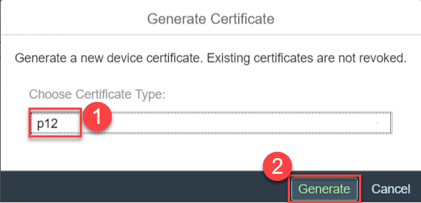.

1. Save the certificate on your machine paying attention to the place where you are putting it

1.	Copy the secret key and paste it in a text editor because it will be required later in the exercise. Once done, click on **Ok** to close the window  
	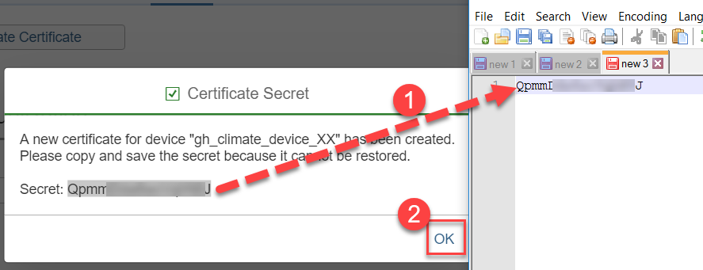

1. As a side note, if you need to know where you downloaded the certificate, you can click on the small down arrow on the Chrome status bar and click on **Show in Finder** for MAC users or **Show in Explorer** for Windows users  
	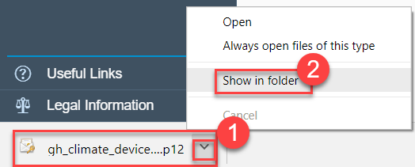

	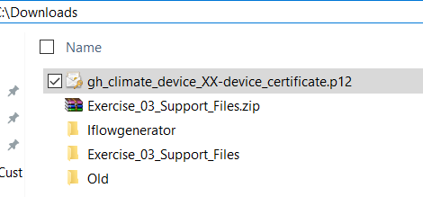

1. Congratulations! You have successfully on-boarded a new device and a new sensor.


### <a name="install-certificate"></a> Install the certificate
At this point we need in some way to install the certificate we have downloaded in your system so that it can be used by a REST client like POSTMAN, to post sensor data and also to read the posted sensor data. 

1. Open Chrome browser and go to <chrome://settings> and Search for SSL in search text field: you get **Manage HTTPS/SSL certificates and settings**. Click on this link
	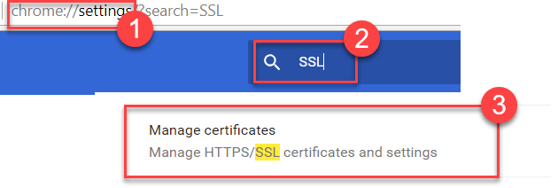

1.	Once in the certificate manager, go to the **Personal** tab and click on **Import...**  
	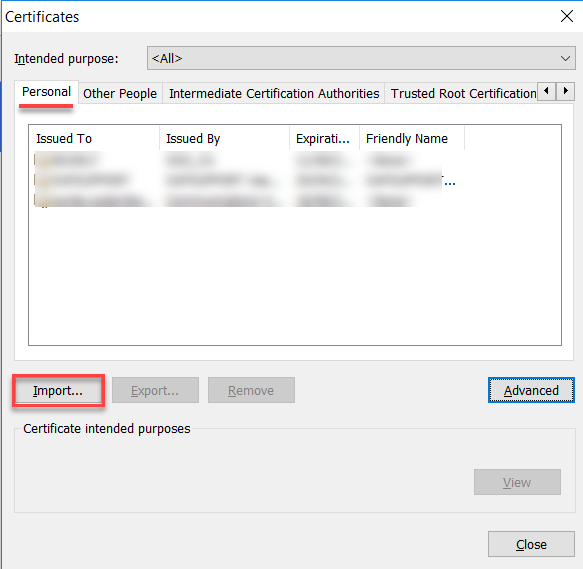

1.	**Certificate Import Wizard** will be opened: click on **Next**  
	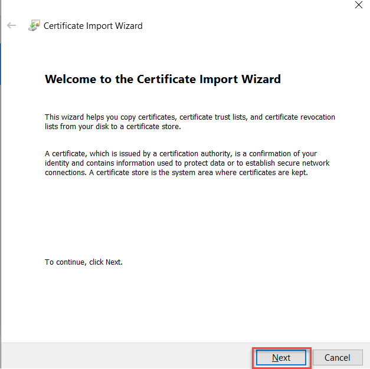

1.	Browse to folder where you have saved the device p12 certificate and choose "Personal Information Exchange p12" in the file extension drop down list
	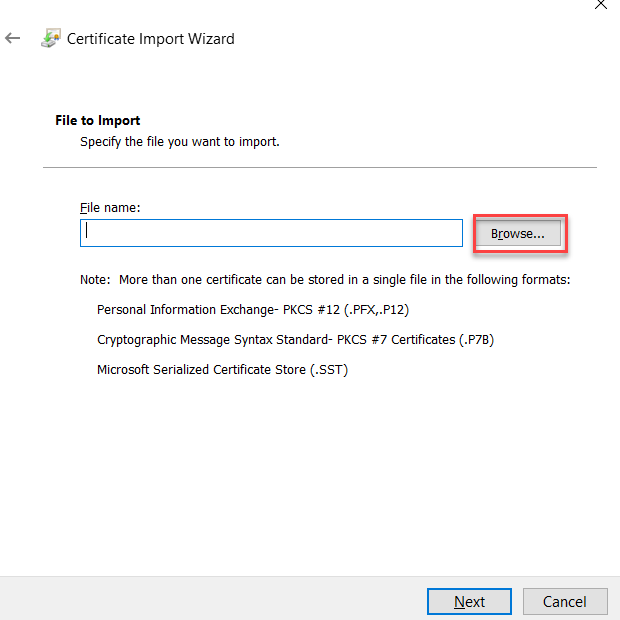
	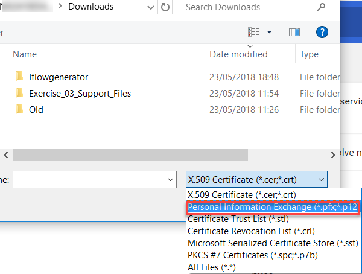  

1.	Select the certificate and click **Open**  
	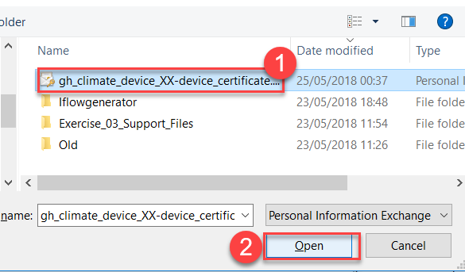

1.	Enter the **secret key** you obtained while downloading device certificate and noted down in a text editor; then click **Next**  
	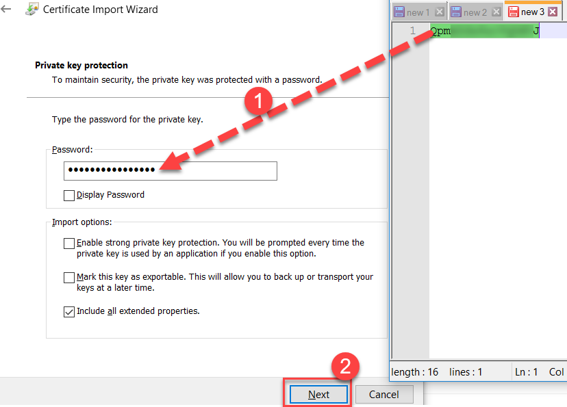

1. Click **Next**  
	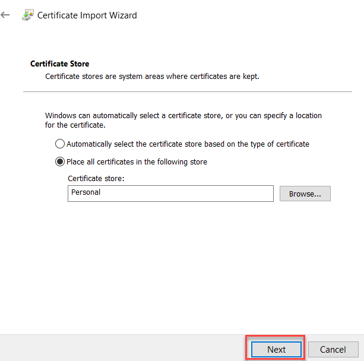

1.	Finally, click on the **Finish** button  
	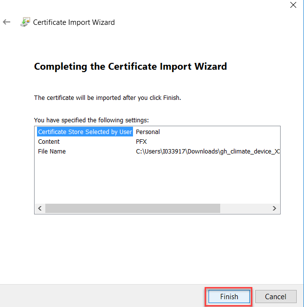

1.	You should receive the information that the import was successful.  
	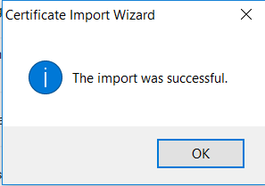

### <a name="sending-messages"></a> Sending messages via REST using Postman

1. If you have Chrome and/or Postman open, please close all windows before proceeding. Then open a new Chrome browser and navigate to <chrome://apps> and Click on **Postman**
	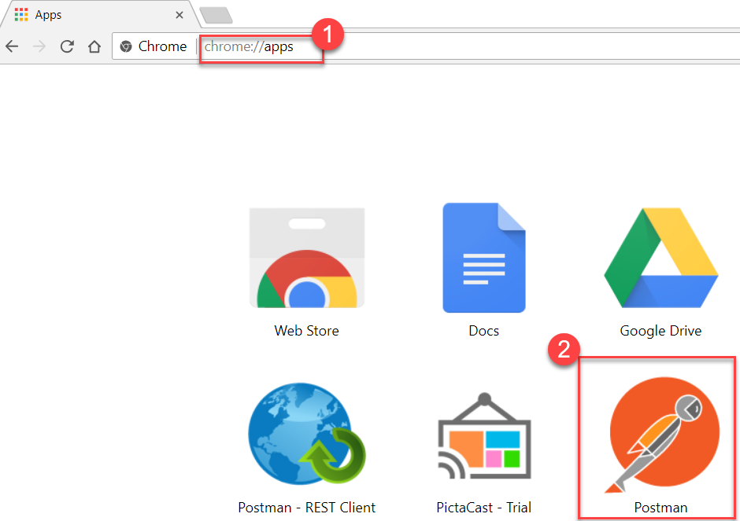

1. You will be prompted to download a desktop client of Postman. Just click on the X on the top right hand side of the pop up box. **DO NOT DOWNLOAD THE LATEST VERSION**. 
	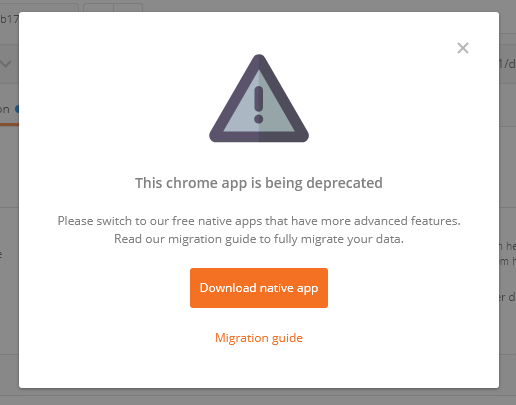

1. Choose **POST** as new request type and enter as URL the line

	```
	https://<host_name>/iot/gateway/rest/measures/<device_alternate_id>
	```
replacing **\<host\_name\>** with the host name of your IoT service and **\<device\_alternate\_id\>** with the alternate ID of your device **\<gh\_climate\_device\_XX\>** as seen in the IoT service cockpit
	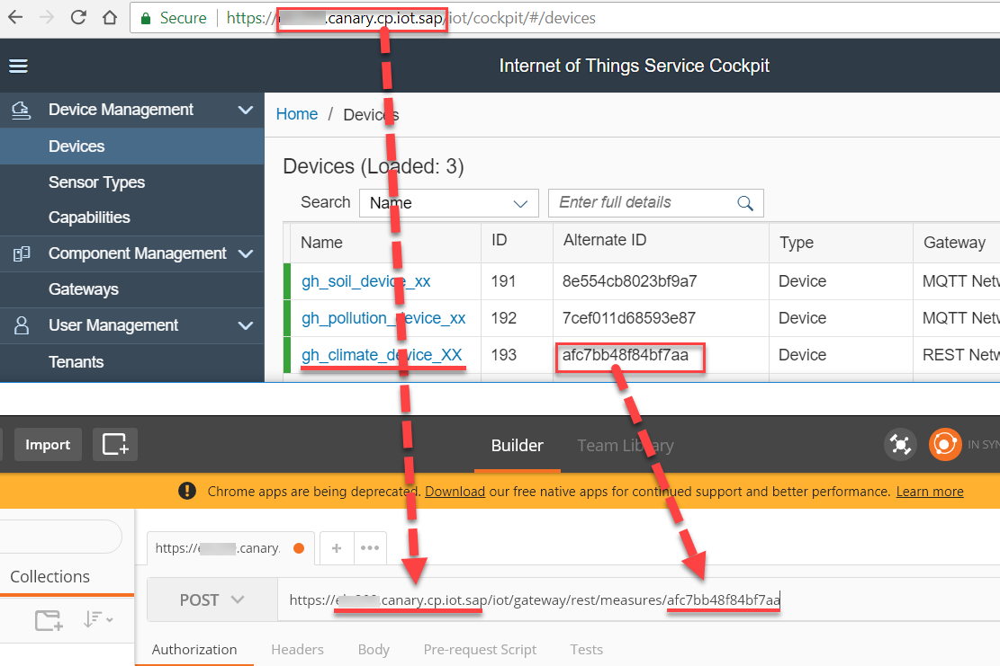

1. In the **Authorization** tab Choose **NoAuth** as **Type**  
	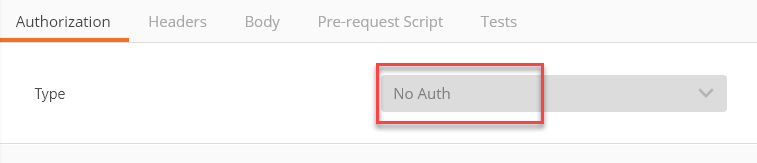

1. In the **Headers** tab, add a new header with `Content-Type = application/json`  
	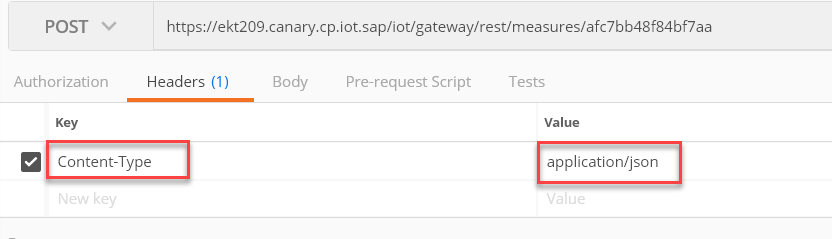

1. In the **Body** tab, select **raw** mode and enter the string

	 ```
	 {"capabilityAlternateId":"<Temperature_Alternate_ID>","measures":[20],"sensorAlternateId":"<Sensor_alternate_ID>"}
	 ```

1. Replace **\<Sensor\_alternate\_ID\>** with the alternate ID of your sensor **\<gh\_climate\_sensor\_XX\>**.  
 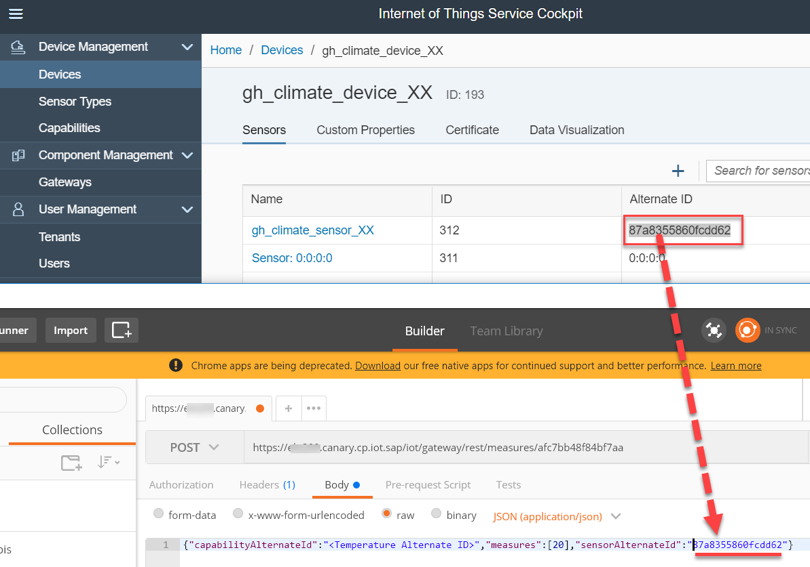

1. and replace **<Temperature_Alternate_ID>** with the alternate ID of your Temperature capability, found under your sensor **gh\_climate\_sensor\_typ\_XX** in **Sensor Types**.
Then click on **Send**
	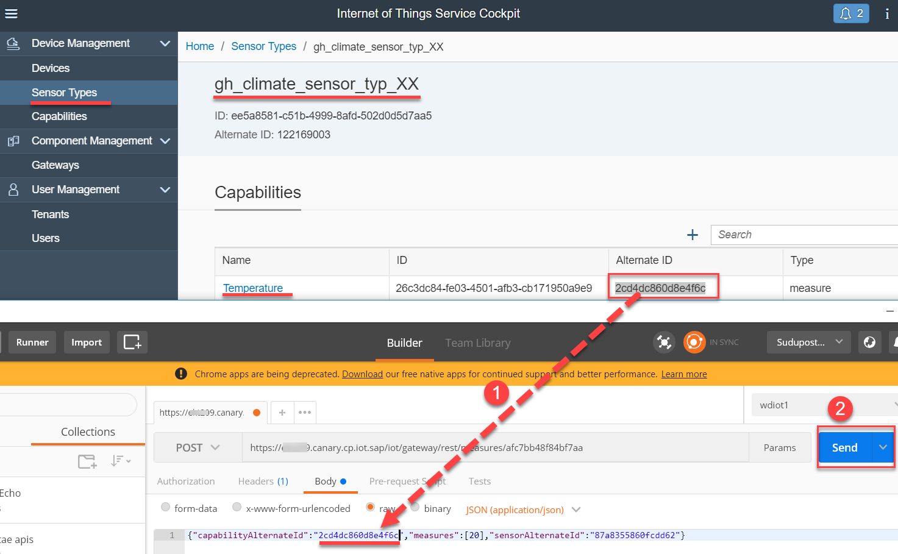

1. Select the right certificate and click on **OK**
	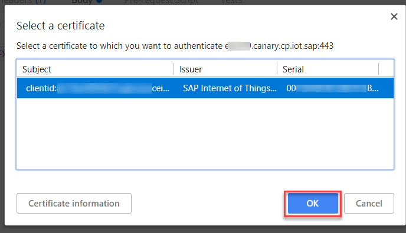

1. Enter your credentials if required  
	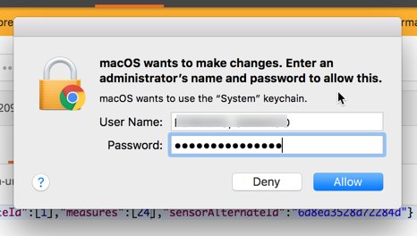

1. You should get a return code of 200. This means that your POST request was successful  
	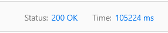

1. Repeat the step by changing (increasing or decreasing) the temperature value and sending the request again  

1. Congratulations! You have successfully sent some data to the IoT service using Postman REST Client.


### <a name="consuming-sensor-data"></a> Consuming and viewing sensor data
This section explains various ways we can consume and visualize the measurements which are sent to IoT Gateway Cloud.

1.	Open the Internet of Things Service Cockpit with your user credentials. In the main menu, go to Devices. Select your device (**gh\_climate\_device\_XX**) and click on the **Data Visualization** tab  
	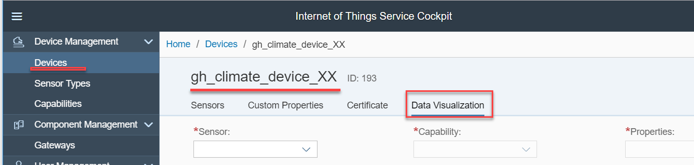

1.	For the 3 drop down list select the following parameters, replacing **XX** with your workstation ID;

	|Parameter|Value|
	|---------|-----|
	|Sensor| gh\_climate\_sensor\_XX|
	|Capability| Temperature |
	|Properties| Temperature |

	The values will be displayed in a line chart
	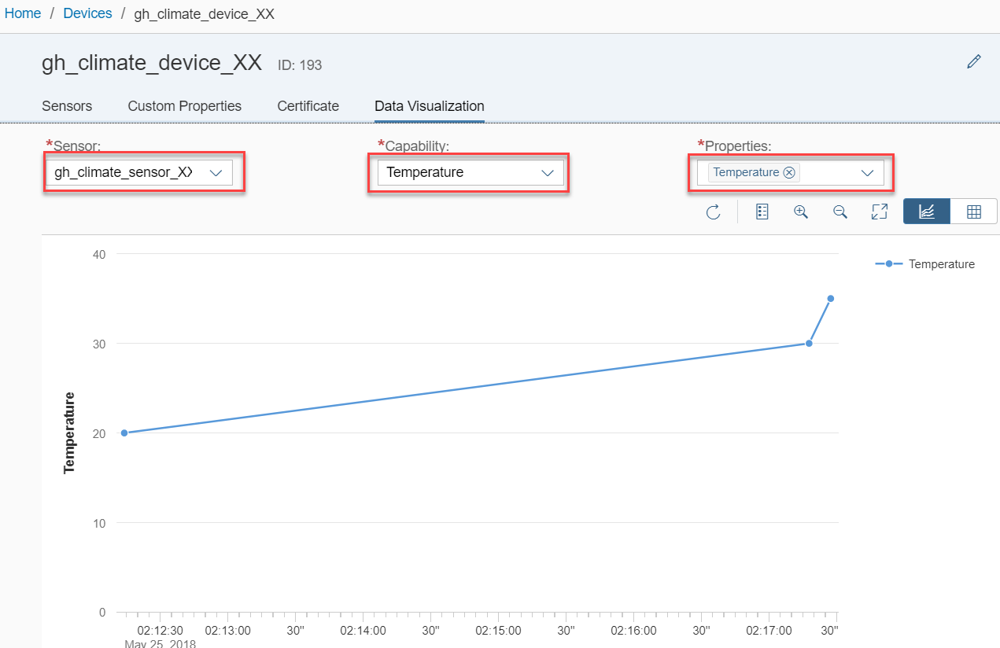

1.	Data can be also read from a REST client. In this case we will use again Postman, but with a basic authentication method, so **close Postman if it's already open and close the Chrome browser as well**.  

1. Reopen Chrome browser and go again to the <chrome://apps> link. Open Postman and click on the **+** sign after the last tab, to open a new tab. If you see the certificate prompt, click on "cancel".  
	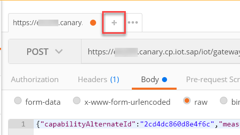

1. Select GET as the request type and enter the URL

	```
	https://<host_name>/iot/core/api/v1/devices/<device_ID>/measures
	```

	where **\<host\_name\>** is the host name of your IoT Service and **\<device\_ID\>** can be read in the device page under the device name

	>NOTE: Note down the **device\_ID** and the **host\_name** used here, since this information will be required at a later part of the exercise  

	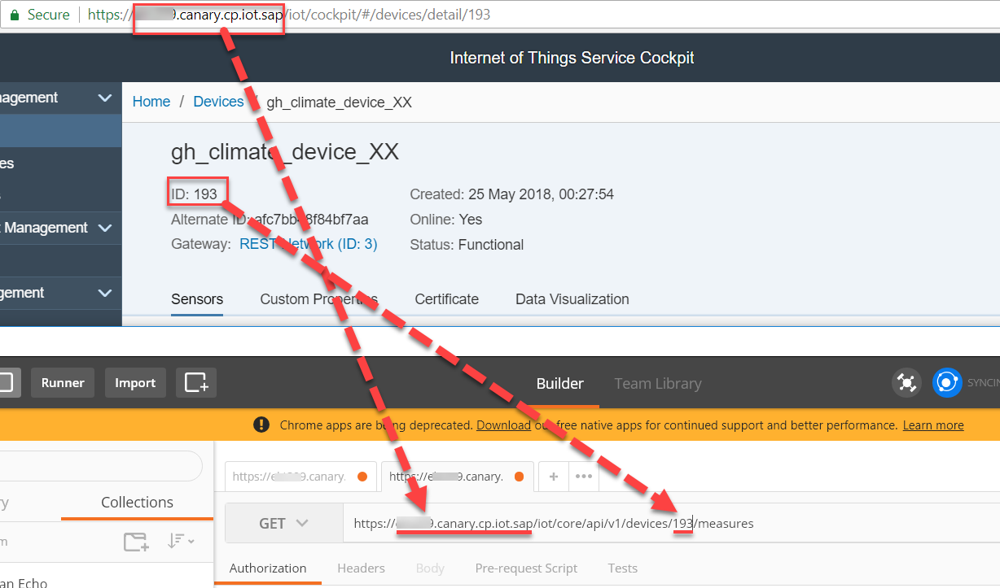

1.	Go to the **Authorization** tab, select **Basic Auth** type, enter your **credentials** for the IoT service and click on **Update Request**  
	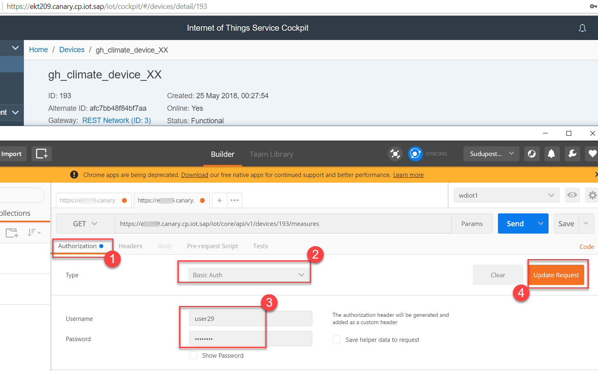

1.	Go to the **Headers** tab and enter the header `Accept = application/json`. Then click on **Send**  
	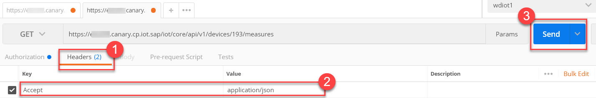

1. Click on **Cancel** if your get the request to choose the certificate: this because we are using Basic Authentication this time  
	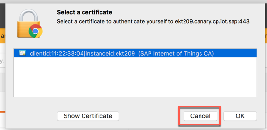

1.	You will see the results in the body section  
	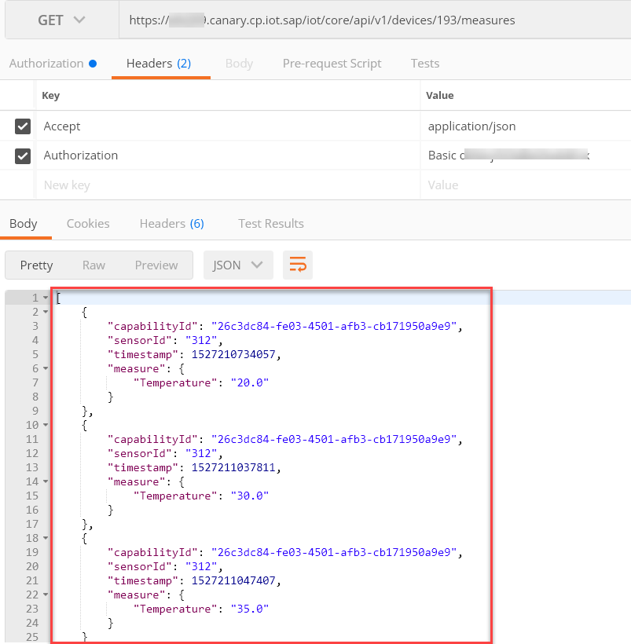

1. Congratulations! You have successfully consumed and analyzed sensor data.


## Summary
You have completed the exercise!

You are now able to:

* onboard a device with IoT Gateway Cloud using REST protocol
* send data with a REST client

Please proceed with next exercise.
