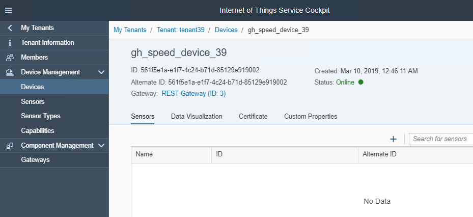
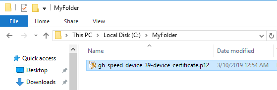

<table width=100% border=>
<tr><td colspan=2><h1>EXERCISE 04 - Python and openSSL</h1></td></tr>
<tr><td><h3>SAP Partner Workshop</h3></td><td><h1> &nbsp;45 min</h1></td></tr>
</table>


## Description
This document provides you with an introduction on how to use Python to load data into SAP IoT Services. The first activity causes some ramdom data to be loaded, and the second (optional) exercise shows how you can turn your Windows RDP into an IoT Device.

## Target group

* Developers
* People interested in SAP Leonardo


## Goal

The goal of this exercise is to have a quick introduction into openSSL and Python.


## Prerequisites
  
Here below are prerequisites for this exercise. 

* Chrome browser
* SAP IoT Service system (provided by your instructor)

## Steps

### <a name="device-and-sensor-onboarding"></a> Device and sensor onboarding

1.	Open the browser and navigate to the IoT Service Cockpit URL and log on with the tenant user credentials, provided by the instructor.  
	
	
1.	You'll see access to the tenant you have been allocated. You'll be using the ID for this tenant a few times during the workshops, so it's a good idea to note the ID number (in Notepad++ for example). When you have noted it, click on the tenant.
	
	
1.	You'll then get an "Overview" of the objects you are using.
	

1.	Use the main menu to navigate to the **Device Management** -> **Capabilities** section and click on the **"+"** sign, to add first capability Speed.

1. In the **General information** section enter **Name** as **Speed** and in the **Properties** section enter the following information and click on **Create**. Ensure the capability is created successfully

	| Parameter | Value    |
	| --------- | -------- |
	| Name | Speed     |
	| Data Type | float    |
	| Unit Of Measure | MpH |

	

1. Navigate to **Device Management** -> **Sensor Types** and click on the "**+**" sign to add a sensor type for the Speed Sensor. 

1. In the **General information** section enter **Name** as **gh\_speed\_sensor\_typ\_XX**, where **XX** is your workstation ID and in the **Capabilities** section enter and add the earlier created capabilities

	| Capability | Type       |
	| --------- | ----------- |
	| Speed | measure       |

	

	Click on **Create**. Ensure the Sensor Type is created successfully

1. Congratulations! You have successfully created a new data model.

We need to create a device that corresponds to a physical device. Also we onboard the sensor for the Device.

1.	Use the main menu to navigate to **Device Management** -> **Devices** section and click on the "**+**" sign to start the device creation process.

In this exercise, we will create it via UI cockpit  

   

1.	In the **General Information** section, enter the following information and click on **Create**

	| Parameter | Value |
	| --------- |----- |
	| Name | gh\_speed\_device\_XX |
	| Gateway |REST Network |
	| Alternate ID | \<leave it blank\> |

1.	In the new device, Sensor tab click on the "**+**" sign to create a new sensor  
	

1.	In the General Information section, enter a name such as "**gh\_speed\_sensor\_XX**", replace XX for your workstation ID, select Sensor Type you have created earlier (i.e. where **XX** must be replaced with your workstation ID) and ignore the Alternate ID as it's optional. Once done click on **Add**  
	

1.	The new sensor is created and you should be able to see the **gh\_speed\_sensor\_XX** under the **Sensors** tab of the gh\_speed\_device\_XX device onboarded earlier  
	

1. Be sure that your gh\_speed\_device\_XX device is selected, choose the **Certificate** tab and click on **Generate Certificate**  
	

1. Choose the Certificate Type **P12** and click **Generate**  
	

1. This will trigger a popup window providing you with a secret key which you must copy and save in notepad. Then click **OK**  
	

1. You can also see the downloaded certificate *gh\_speed\_device\_XX-device\_certificate.p12* in the Chrome browser status bar. Click on the small down arrow and choose **Show in folder**. This will make you understand where the certificate is located. Please keep in mind this location since it will be used in the next section  
	

1. Congratulations! You have successfully onboarded a new device and a new sensor.

### <a name="python-script"></a> Build a Python script to send some data
In case for example you want to send data from your Raspberry PI, you may want to build a Python script which reads the GPIOs values sending them to the IoT service. In this example, we are going to send some random data, but it's easy to understand how the same script can be adapted to work with a real device 


1. Create a new folder on your machine

1. Copy to this folder the *gh\_speed\_device\_XX-device\_certificate.p12* certificate you have already imported in your system. 
	
	
1. We need to convert the certificate, splitting it in two parts: a PEM and a KEY files. Open a DOS window and go to this folder  
	

1. Run the command `openssl pkcs12 -in <certificate_name>.p12 -nokeys -out certificate.pem`, where **\<certificate\_name\>** is the name of the certificate you have downloaded for your device, to convert the certificate file from p12 to PEM. You will be requested to enter the secret key received when you generated the certificate  
	

1. Run the command `openssl pkcs12 -in <certificate_name>.p12 -nocerts -out privkey.pem`, where **\<certificate\_name\>** is the name of the certificate you have downloaded for your device, to generate the private key with passphrase: first enter the secret key received when you generated the certificate and then an arbitrary PEM password (say: 1234)
	

1. Run the command `openssl rsa -in privkey.pem -out certificate.key` to remove the passphrase from the key since it's not supported in the Python "requests" library. You will be requested to re-enter the password specified at the previous step (i.e. 1234)  
	

1. In your folder you should have now two files: a certificate "*certificate.pem*" and a key "*certificate.key*". The "*privkey.pem*" can be deleted because no longer needed  
	

1. Inside this folder create a new file named *send\_data.py* with the following content (it is best to copy the code from https://raw.githubusercontent.com/saphanaacademy/SCP-IoT/master/send_data.py to avoid formatting issues) ; 

	```py
	import sys
	import requests
	import json
	import time
	import math
	import random
	
	# replace these variables
	deviceAlternateId = '<your_device_alternate_ID>'               # the device Alternate ID
	sensorAlternateId = '<your_sensor_alternate_ID>'               # the sensor Alternate ID
	capabilityAlternateId = '<your_capability_alternate_ID>'       # the capability Alternate ID
	tenant = 'https://<your_host_name>/iot/gateway/rest/measures/' # the IoT Service Host Name
	
	postAddress = (tenant + deviceAlternateId)
	print ('Posting to:', postAddress)
	
	# Time intervall for polling the sensor data in seconds
	timeIntervall = 5
	
	# Number of iterations
	iterations = 20
	
	
	for x in range (0, iterations):
	
	    try:
	        print("")
	        print("============================================")
	        print("Reading sensor data ...")
	  
	        speed = random.randint(0,40)

        	  valueSpeed = round(speed,2)
            print("speed value = %f" %valueSpeed, "MpH")

            bodyJson =  {
                    "capabilityAlternateId":capabilityAlternateId,
                    "sensorAlternateId":sensorAlternateId,
                    "measures":[valueSpeed]
                    }
	
	        data = json.dumps(bodyJson)
	        headers = {'content-type': 'application/json'}
	        r = requests.post(postAddress,data=data, headers = headers,cert=('certificate.pem', 'certificate.key'), timeout=5)
	        responseCode = r.status_code
	        print (str(bodyJson))
	        print ("==> HTTP Response: %d" %responseCode)
	        
	        # wait timeIntervall [s] before reading the sensor values again
	        time.sleep(timeIntervall)
	        
	    except IOError:
	        print ("Error")
	
	```
	

1. In this code, replace the following variables with your values and save the file
	- **\<your\_device\_alternate\_ID\>** with your device Alternate Id
	- **\<your\_sensor\_alternate\_ID\>** with your sensor Alternate Id
	- **\<your\_capability\_alternate\_ID\>** with your capability Alternate Id
	- in the tenant URL, replace **\<host\_name\>** with the one provided by your instructor  
	

1. If you want you can also adjust two other parameters like the **timeInterval** which is set to 5 seconds and the numeber of **iterations** which is set to 20. The first one is the interval between each send command and the second is how many send commands you want to issue  

1. From the Terminal window, run the command `python send_data.py`. You may need to install the requests package first (`easy_install requests` or `pip install requests`). 
	
	
1.	For each iteration you should receive a **HTTP Response** code of **202**. After a few iterations, you can enter CTRL-C to stop the Python Script running.  
	

1. If you look now at the Data Visualization page of your Device you should see the values you just sent.  
	


## Optional: Turning your Windows RDP into an IoT Device !

1. Here is some Python, which turns your Windows RDP into an IoT Device ;) It measures the CPU / Memory on the RDP. If you have time, go through the same steps as above (build a capability called "CPU", then a sensor type, device and sensor, and export the certificate, etc) and see if you can make it work ... you can change the values by simply opening / clsoing some apps (such as Chrome), to see the CPU increase/decrease. 

1. It is best to copy the code from https://raw.githubusercontent.com/saphanaacademy/SCP-IoT/master/send_CPU_data.py to avoid formatting issues). Additionally, see this video which details the steps if you are stuck https://www.youtube.com/watch?v=IKX7sij5vX0&list=PLkzo92owKnVzQ7YTkThwiTGOautId39g6&index=13.

	```py
	import requests # http://docs.python-requests.org/en/master/
	import psutil   # https://pypi.python.org/pypi/psutil
	import time 
	import json

	deviceAlternateId = '<your_device_alternate_ID>'               # the device Alternate ID
	sensorAlternateId = '<your_sensor_alternate_ID>'               # the sensor Alternate ID
	capabilityAlternateId = '<your_capability_alternate_ID>'       # the capability Alternate ID
	tenant = 'https://<your_host_name>/iot/gateway/rest/measures/' # the IoT Service Host Name     

	start = 'https://'
	main = '/iot/gateway/rest/measures/'
	postAddress = (start + tenant + main + deviceAlternateId)

	print ('Posting to:', postAddress)

	def readsensors():
		global d_pctCPU
		d_pctCPU = psutil.cpu_percent(percpu=False, interval = 1)
	
		return

	def postiotcf ():
		global d_pctCPU

		s_pctCPU = str(d_pctCPU)
		d_tstamp = time.asctime()
	
		print("\nValues to post: ", d_pctCPU, d_tstamp)
	
		bodyJson =  	{
        			"capabilityAlternateId":capabilityAlternateId,
        			"sensorAlternateId":sensorAlternateId,
                	"measures":[s_pctCPU]
                		}

		data = json.dumps(bodyJson)
		#uncomment the line below to see the JSON being sent
		#print (str(bodyJson))

		headers = {'content-type': 'application/json'}
		# uncomment below 3 lines to send to SCP
		#r = requests.post(postAddress,data=data, headers = headers,cert=('certificate.pem', 'certificate.key'), timeout=5)
		#responseCode = r.status_code
		#print ("==> HTTP Response: %d" %responseCode)
    
	try:
		while(True):
			readsensors()
			postiotcf()
			time.sleep(2)
	except KeyboardInterrupt:
		print("Stopped by the user!")
	```

## Summary
You have completed the exercise! 

You are now able to understand how Python and openSSL can easily be used to send data to SAP IoT Services.
